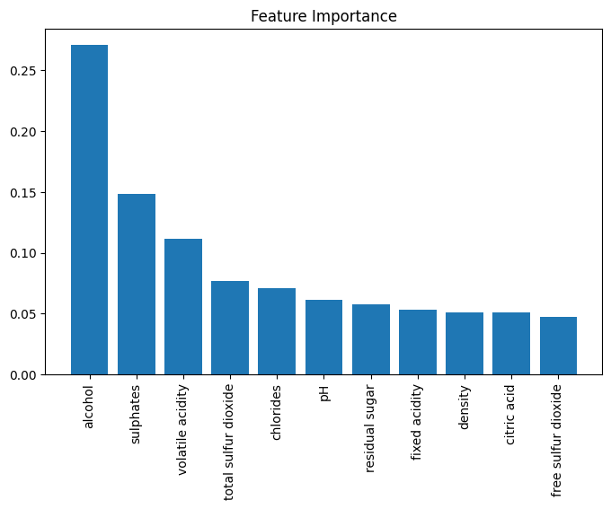

# Wine Quality Analysis and Machine Learning

This project analyzes the red wine quality dataset and builds machine learning models to predict wine quality.

## Project Overview

The goal of this project is to explore the relationship between physicochemical wine properties and wine quality. The project includes exploratory data analysis, regression modeling, classification modeling, feature importance analysis, cross-validation, and hyperparameter tuning.

## Dataset

The dataset contains red wine samples with features such as alcohol, sulphates, volatile acidity, chlorides, and total sulfur dioxide. The target column is `quality`, which ranges from 3 to 8.

## Technologies Used

- Python
- Pandas
- NumPy
- Matplotlib
- Seaborn
- Scikit-Learn

## Key Findings

- Most wine samples have quality scores of 5 or 6.
- Alcohol, sulphates, and citric acid showed positive relationships with wine quality.
- Volatile acidity and total sulfur dioxide showed negative relationships with wine quality.
- Random Forest performed better than Linear Regression for regression.
- Logistic Regression achieved an AUC score of 0.815 for classifying good and bad wines.

## Model Results

### Regression

Linear Regression:
- MAE: 0.503
- MSE: 0.390
- R² Score: 0.403

Random Forest Regressor:
- MAE: 0.422
- MSE: 0.301
- R² Score: 0.539

### Classification

Logistic Regression:
- Accuracy: 0.740
- Precision: 0.788
- Recall: 0.726
- F1 Score: 0.756
- ROC-AUC: 0.815

## Visualizations

## Future Improvements

- Try XGBoost
- Improve feature engineering
- Use advanced hyperparameter tuning
- Compare more classification models
- Build a cleaner production-ready ML pipeline
